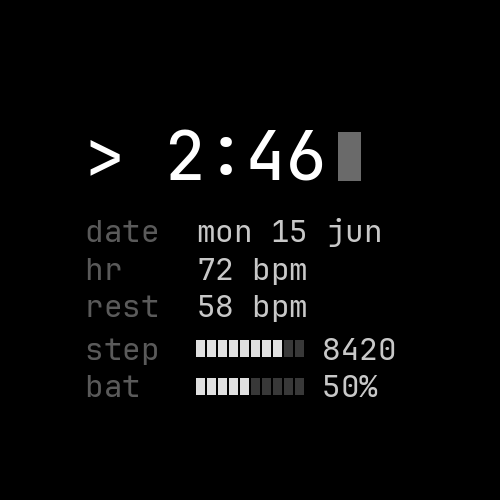

# uptime

A minimalist, monochrome **terminal** watch face for Garmin (Venu 4).



Time as a shell prompt with a blinking cursor, plus a clean console readout —
date, heart rate, resting HR, a step-goal bar and a battery bar — set in
JetBrains Mono on true black, with a burn-in-safe always-on mode.

## Develop

The Connect IQ SDK is packaged in a self-contained Nix dev shell.

```bash
nix develop                  # monkeyc, simulator, sdk-manager, jdk on PATH
nix develop -c connectiq     # run the simulator
./dev.sh                     # build + hot-reload into the running sim
```

First time only — create a signing key and pull device files (free Garmin account):

```bash
openssl genrsa -out developer_key.pem 4096
openssl pkcs8 -topk8 -inform PEM -outform DER -in developer_key.pem -out developer_key -nocrypt
connect-iq-sdk-manager-cli login && connect-iq-sdk-manager-cli agreement accept
connect-iq-sdk-manager-cli device download --manifest manifest.xml --include-fonts
```

## Build & flash

```bash
monkeyc -d venu441mm -f monkey.jungle -o bin/uptime.prg -y developer_key   # build
./flash.sh                                                                 # install over USB (MTP)
monkeyc -e -f monkey.jungle -o bin/uptime.iq -y developer_key              # store package
```

Devices: `venu441mm` / `venu445mm` (Venu 4 41/45 mm). Fonts are generated from
JetBrains Mono via `tools/genfont.py`.
